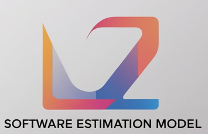

<table>
  <tr>
    <td style="width: 20%;"></td>
    <td style="font-size: 2em;"> Proyecto de Implementación del Modelo de Estimación COSMIC en una entidad del Gobierno Federal en México de nueva creación. </td>
  </tr>
</table>

<h3 style="color: #5D9EC1;">📋 Descripción general</h3>


La siguiente propuesta se generó con fines ilustrativos esperando que contribuya en las  estrategias de implementación de modelos de estimación de software, que para el caso del presente trabajo, se tomó como base el modelo de estimación: "Common Software Measurement International Consortium." (en adelante COSMIC). Dicho trabajo no se hubiera concluido con éxito sin la estrecha colaboración  entre los analistas de la fábrica de software (en adelante FS) y expertos del área de negocio (en adelante AN) de la entidad gubernamental para desarrollar una primera versión de los casos de uso de un sistema de flujo de trabajo.

<h3 style="color: #5D9EC1;">✴️ Alcance del Proyecto</h3>

El sistema de flujo de trabajo modelado involucró tres subprocesos:

1. Flujo de solicitantes: Generación de la plataforma digital para la elaboración de solicitudes de un trámite.

2. Flujo Interno de las áreas de trabajo: Generación de la plataforma interna de la entidad para lograr generar los flujos colaborativos entre las diversas áreas del negocio que les permitieran analizar y dictaminar el trámite.  
   
3. Resolución del trámite: Generación de la resolución positiva o negativa según corresponda para el interesado.

<h3 style="color: #5D9EC1;"> 📌 Estrategia de implementación</h3>

La implementación del modelo COSMIC se desarrolló mediante las siguientes etapas:

1. Colaboración Interdisciplinaria:

   * Trabajo conjunto entre analistas de la FS y AN para la elaboración de los casos de uso del sistema.

2. Recopilación de datos:

   * Registro de los tiempos para concluir la fase de análisis del proyecto.

   * Evaluación del rendimiento para determinar el factor de productividad (en adelantel FP).

3. Aplicación de COSMIC Function Points (CFP):

   * Contabilización de los CFP basada en los casos de uso desarrollados.

   * Ajuste del esfuerzo requerido excluyendo el tiempo de análisis previamente documentado y ajustando los CFP con los valores del contrato de la FS.

4. Definición de Proyecto a Costo Fijo:

   * Uso de los resultados de la contabilización de CFP para definir el proyecto con un esquema de costo fijo con la fábrica de software.

<h3 style="color: #5D9EC1;"> 🛠️ Tecnologías utilizadas</h3> 

- Jupyter Notebook: Herramienta para documentar y ejecutar el código para representar los resultados del modelo COSMIC.

- Modelo COSMIC: Estándar para la medición funcional de software.

- Python: Lenguaje de programación para el análisis del presente trabajo.

- Bibliotecas de Python: Pandas y Matplotlib principalmente.

<h3 style="color: #5D9EC1;"> 💡Resultados generados.</h3> 

- Primera versión del modelo de estimación COSMIC mejorando su precisión a través de la generación previa del análisis.

- Generación de un  modelo  de estimación más preciso para la ponderación del costo del proyecto.

- Mejora en la toma de decisiones relacionadas con la asignación de recursos y tiempos.

- Base sólida para futuros proyectos de costo fijo.

<h3 style="color: #5D9EC1;"> 📀 Estructura del repositorio</h3> 

```plaintext
├── notebooks/
│   └── analisis_cosmic.ipynb  # Notebook principal del proyecto
├── data/
│   └── horas_rh.csv           # Horas invertidas fase análisis 
│   └── resultado_cfp.csv      # Estimación de los CFP con base a los CU 
├── README.md                  # Documentación
├── requirements.txt           # Dependencias
```

<h3 style="color: #5D9EC1;">🔗 Tabla de referencias</h3> 

- Modelo de estimación
   * https://cosmic-sizing.org/

- Norma Oficial Mexicana que sustentó el uso del modelo COSMIC para este proyecto
   * http://dof.gob.mx/nota_detalle.php?codigo=5456195&fecha=11/10/2016
  

<h3 style="color: #5D9EC1;">🚀 Instalación</h3> 

1. Clonar el repositorio:
   ```bash
   git clone https://github.com/usuario/AnalisisCOSMIC.git
   ```
2. Instalar las dependencias:
   ```bash
   pip install -r requirements.txt
   ```
3. Ejecutar el notebook principal
   ```
   notebooks/analisis_cosmic.ipynb
   ```

<h3 style="color: #5D9EC1;"> 🤝 Contribuciones</h3> 

Las contribuciones son bienvenidas. Por favor, crea un pull request o abre un issue para discutir cambios.

<h3 style="color: #5D9EC1;"> 📢 Puntos a Considerar</h3>

- El trabajo presentado tiene como única finalidad mostrar una alternativa para la implementación del modelo de estimación COSMIC  cuando no exista información histórica. La información presentada se cambió y generalizó y no representa de ninguna manera un riesgo en la privacidad de la informacipon para la entidad gubernamental ni compromete de ninguna forma el proyecto implementado.
- Asegúrate de tener todas las dependencias instaladas.
- Lea la documentación antes de manipular el proyecto.
- Este proyecto utiliza el modelo *COSMIC*. Todos los derechos reservados © Cosmic Sizing Organization, 2025. Para más información, visita: https://cosmic-sizing.org/

<h3 style="color: #5D9EC1;">➿ Licencia</h3>

Este proyecto está bajo la Licencia MIT.


